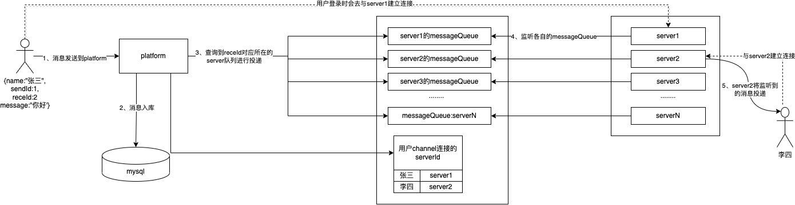
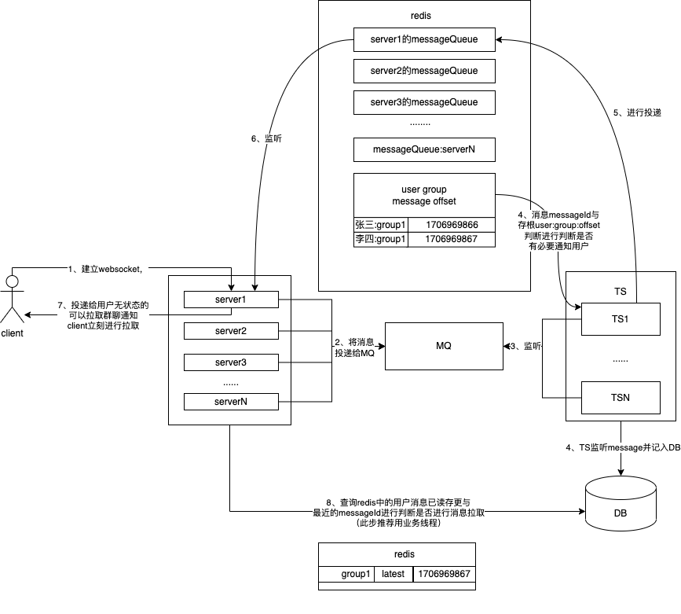

#### 项目介绍
1. IM是一个分布式聊天系统，目前完全开源，仅用于学习和交流。
1. 支持私聊、群聊、离线消息、发送图片、文件、好友在线状态显示等功能。
1. 后端采用springboot+netty实现，前端使用vue。
1. 服务器支持集群化部署，每个im-server仅处理自身连接用户的消息

#### 项目结构
|  模块  |     功能 |
|-------------|------------|
| im-platform | 与页面进行交互，处理业务请求 |
| im-server   | 推送聊天消息|
| im-client   | 消息推送sdk|
| im-common   | 公共包  |

#### 消息推送方案（推方案）

- im通过长连接实现消息推送，单机情况下不同用户的channel是在同一台机器上可以找到并且投递，当场景转换为分布式后，不同的用户channel可能是不同的server在维护，我们需要考虑如何将消息跨server进行投递
- 利用了redis的list数据实现消息推送，其中key为im:unread:${serverid},每个key的数据可以看做一个messageQueue,每个server根据自身的serverId只消费属于自己的queue
- 同时使用一个中心化存储记录了每个用户的websocket连接的serverId,当用户发送消息时，platform将根据receId所连接的server的id,决定将消息推向哪个queue
- 每个server会维护本地的channel，收到messageQueue中的消息后找到对应的Queue进行投递

#### 热点群聊优化方案（推拉结合）

- 在客户端会维护热点群聊的已读offset，用户发送热点群聊消息给server

- server统一将消息通过MQ与TS服务进行解耦，TS服务负责将消息进行入库，同时对比用户存在redis中的已读消息的存根是否有必要将message投递到receId对应的messageQueue

- 若投递到messageQueue后，server消费后投递给client无状态的可以拉取请求

- client收到请求后进行批量拉取，拉取是需要从DB中拉取，防止DB压力过大，用存根offset与group最新消息进行判断是否有必要拉取。

- 拉取操作务必使用异步，可以使用MQ，方便可以使用业务线程，防止单个拉取动作过慢导致work线程阻塞进而影响用户的心跳检测。

